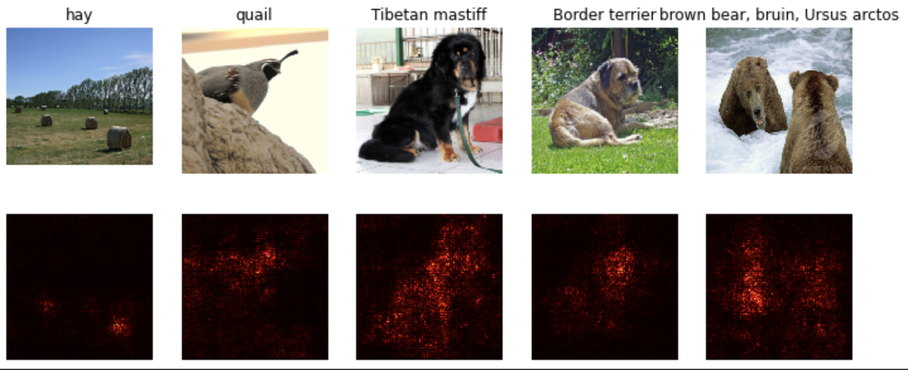
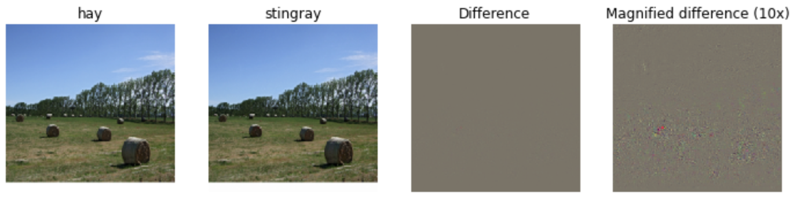
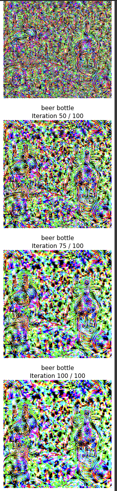

# C231n - Stanford - Computer Vision

## Content of this class
- SVM, Softmax, Regulatization
- Deep Learning
- CNN
- Generative Models
- Hardware and Algorithmics for Modern Deep Learning
- Reinforcement Learning

These are my assignments and lecture notes from Fei-Fei Li's famous Computer Vision Class.

I will be uploading the rest of the assignments along the way.

## Highlights of this class

Here are the highlights of this class for me:

- Saliency Map

 

 

- Fooling a Neural Network with gradient ascent

 

 

- Gradient Ascent, Deep Dream

 

 

 

 

## Links to the video classes

[Youtube Classes](https://www.youtube.com/watch?v=vT1JzLTH4G4&list=PLC1qU-LWwrF64f4QKQT-Vg5Wr4qEE1Zxk)

## Links to the class materials

[Class materials](https://cs231n.github.io)

## Official Stanford Git Repo

[Stanford Official Git Repo](https://github.com/cs231n/cs231n.github.io)

## Solutions of the assignment

[Solutions](https://github.com/mantasu/cs231n)

[Solutions 2 (Chinese)](https://github.com/yjb6/CS231n-2022)
