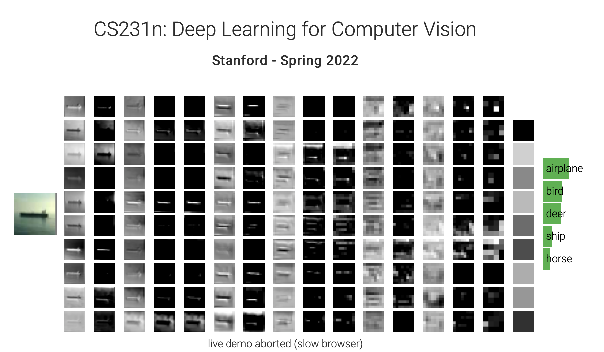
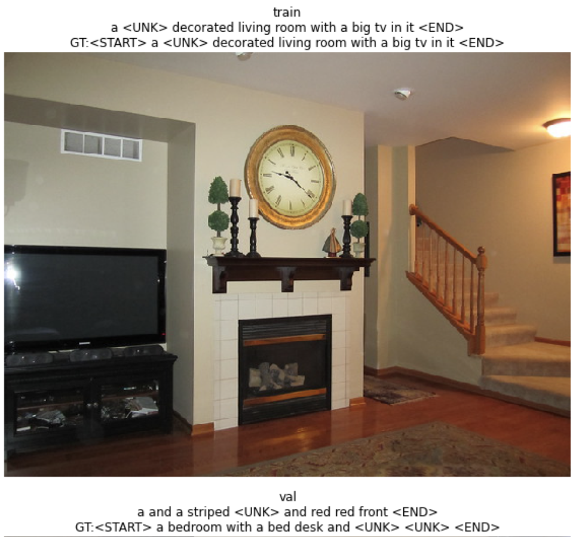
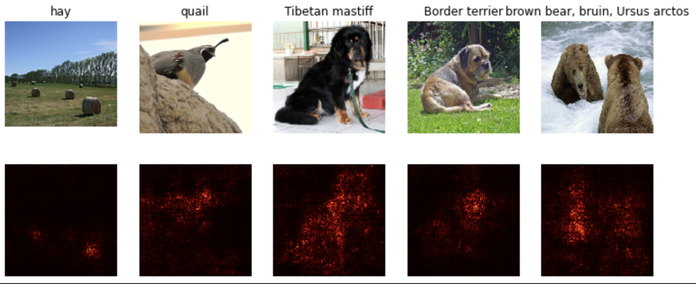
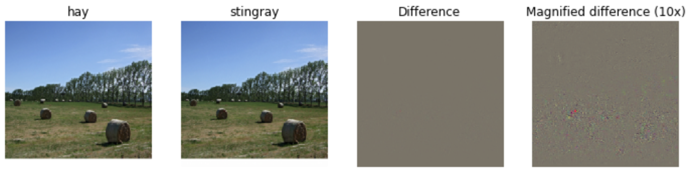
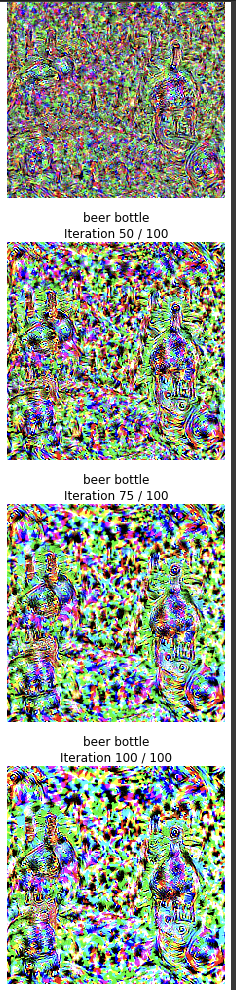

# C231n - Stanford - Computer Vision

 

 

## Content of this class
This is a (non-exhaustive) summary of the content of the CS231N class (2023).

- SVM, Softmax, Regularization
- CNN
- Generative Models, GANs
- Transformers, Attention
- Hardware and Algorithmics for Modern Deep Learning
- Reinforcement Learning
- Self-Supervised Learning

These are my assignments and lecture notes from Fei-Fei Li's famous Computer Vision Class.

## Highlights of this class

Here are the highlights of this class for me:

- Image Descriptions with transformers.

Cool way to map images to captions with transformers. Train on the [Coco](https://cocodataset.org/#home) dataset.

 

 

- Saliency Map

We compute the derivative of the entry pixels in regards to the target class.
I liked this method but GradCam is more powerful in my opinion.

 

 

- Fooling a Neural Network with gradient ascent

Starting from an image and moving in the direction of the gradient, we can actually fool a neural network. The interesting thing is that to the human eye the images are the same. But in fact every pixel is chery picked to activate the neurons in a certain way to predict the wrong output.

 

 

- Gradient Ascent, Deep Dream

Starting from a noise image, we move in the gradient direction to output a specific class. This creates very dreamy images. We can actually visualize some bottles across the different epochs.

 

 

## Official Stanford Git Repo

[Stanford Official Git Repo](https://github.com/cs231n/cs231n.github.io)

