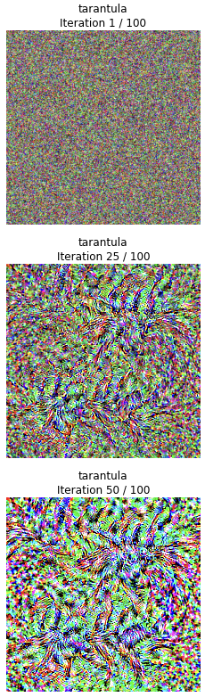

# C231n - Stanford - Computer Vision

 

 

## Content of this class
- SVM, Softmax, Regularization
- CNN
- Generative Models, GANs
- Transformers, Attention
- Hardware and Algorithmics for Modern Deep Learning
- Reinforcement Learning
- Self-Supervised Learning

These are my assignments and lecture notes from Fei-Fei Li's famous Computer Vision Class.

I will be uploading the rest of the assignments along the way.

## Highlights of this class

Here are the highlights of this class for me:

- Saliency Map

 

 

- Fooling a Neural Network with gradient ascent

 

 

- Gradient Ascent, Deep Dream

 

 

 

 

## Official Stanford Git Repo

[Stanford Official Git Repo](https://github.com/cs231n/cs231n.github.io)

